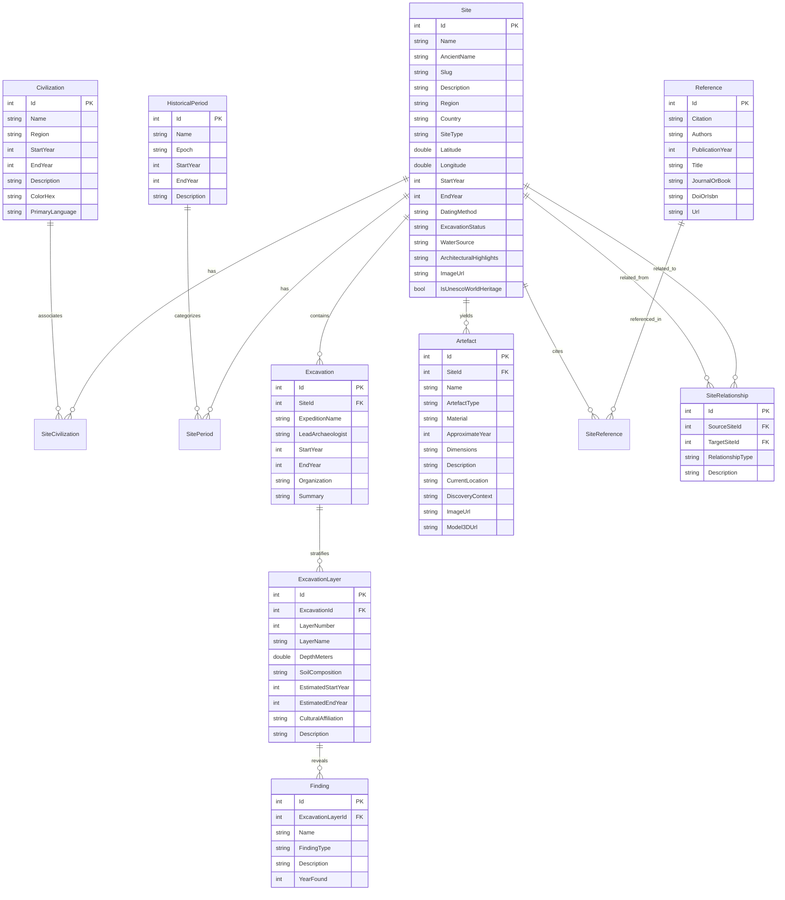

# Archaeological Time Machine - Database Schema & Data Dictionary

## 1. Relational Entity-Relationship Model

## 2. Key Archaeological Informatics Design Principles
1. **Signed Temporal Indexing**: `StartYear` and `EndYear` on both `Site`, `Civilization`, `HistoricalPeriod`, and `ExcavationLayer` allow blazing fast interval overlapping queries: `StartYear <= targetYear AND EndYear >= targetYear`.
2. **Spatial Geographic Coordinates**: Precision `Latitude` and `Longitude` with NetTopologySuite spherical calculations (Haversine / geodesic distance in km for "Nearby sites" queries).
3. **Stratigraphic Sequence**: The `ExcavationLayer` entities allow visual representation of archaeological stratigraphy according to the law of superposition (Layer I at top, deeper layers below).
4. **Citation & Provenance**: Academic citations (`Reference`) are linked to archaeological sites through `SiteReference` ensuring scholarly veracity.
